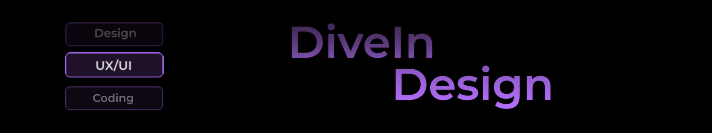

<h1 align="center">DiveIn Design - Forum</h1>

 

<h3>📃 Description</h3>

<strong>DiveIn Design</strong> est un projet de <strong>forum</strong> qui permet aux utilisateurs de publier des topics et des posts.  
L'administrateur peut créer des catégories et bannir des utilisateurs, les empêchant de créer des posts et de répondre aux posts des autres. 
Le projet contient notamment :  
<h4>👤 Un espace profil utilisateur permettant de voir et de gérer les publications</h4>

 
<h4>👨‍💼 Un espace profil administrateur permettant de gérer les utilisateurs et les catégories</h4>

 
